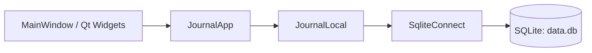
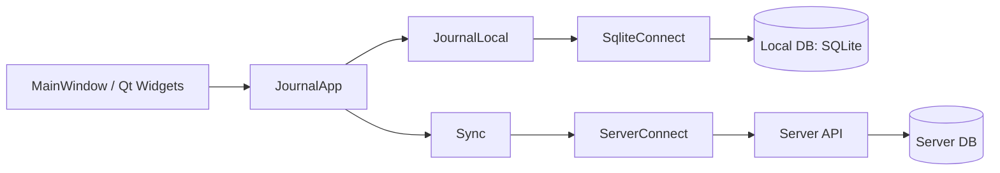

# Architecture

## Цель

Сделать приложение по предложенной архитектуре с минимальной трудоемкостью для MVP:

1. Перенести на архитектуру с локальной реализацией. (Qt + SQLite). Рефакторинг.
2. Прикрутить сервер, с минимальным функционалом для MVP.

## Этап 1: Переделать на локальную архитектуру



### Подробнее

1. `MainWindow` Лицо. Только собирает ввод и показывает данные.
2. `JournalApp` содержит сценарии:
- `loadMonth(...)`
- `addUser(...)`
- `deleteUser(...)`
- `saveMonth(...)`
3. `JournalLocal` запись/чтение данных.
4. `SqliteConnect` — реализация доступа к локальной БД.

## Этап 2: Архитектура для сдачи (добавление сервера)



### Что добавляем

1. `Sync` для кнопки `Sync`, принудительная синхронизация локальной БД с сервером.
2. `ServerConnect` для работы с сервером (запись/чтение данных). По сути коннект с API сервера.
3. Локальная БД остается для офлайна и скорости.

Стрелки в этих диаграммах
- `-->` архитектурная зависимость (кто от кого зависит в коде).

## Минимальные интерфейсы (чтобы не переделывать дважды)

```cpp
struct IJournalStorage {
  virtual ~IJournalStorage() = default;
  virtual std::vector<User> getUsers() = 0;
  virtual std::vector<Attendance> getMonth(int year, int month) = 0;
  virtual void saveMonth(int year, int month,
                         const std::vector<Attendance>& data) = 0;
  virtual void addUser(const std::string& name) = 0;
  virtual void deleteUser(const std::string& name) = 0;
};
```

На этапе 1 реализуется только `JournalLocal` (внутри использует `SqliteConnect`).
На этапе 2 добавляется `ServerConnect`, а `Sync` использует оба источника.

## Минимальная структура проекта

```text
journal_app/
  App/
    Src/
      main.cpp
      mainwindow.cpp
      JournalApp.cpp
      JournalLocal.cpp
      SqliteConnect.cpp
      Sync.cpp                  
      ServerConnect.cpp         
    Inc/
      mainwindow.hpp
      JournalApp.hpp
      IJournalStorage.hpp
      JournalLocal.hpp
      SqliteConnect.hpp
      Sync.hpp                  
      ServerConnect.hpp         
```

## План работ

1. Вынести SQL из `MainWindow` в `JournalLocal`/`SqliteConnect`.
2. Вынести операции кнопок в `JournalApp`.
3. Оставить `MainWindow` только как UI-слой.
4. Проверить проект в локальном варианте (после рефакторинга).
5. Добавить `ServerConnect`.
6. Добавить `Sync` (кнопка для ручной синхронизации).
