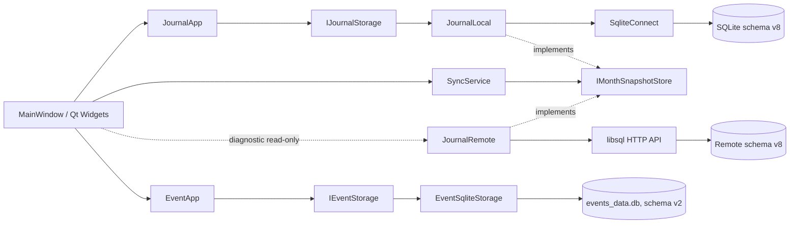

# Architecture

## Слои

```mermaid
flowchart LR
  UI[MainWindow / Qt Widgets] --> APP[JournalApp]
  APP --> ST[IJournalStorage]
  ST --> LOCAL[JournalLocal]
  LOCAL --> SQLITE[SqliteConnect]
  SQLITE --> LDB[(SQLite schema v8)]
  UI --> SYNC[SyncService]
  SYNC --> SNAP[IMonthSnapshotStore]
  LOCAL -. implements .-> SNAP
  REMOTE[JournalRemote] -. implements .-> SNAP
  REMOTE --> API[libsql HTTP API]
  API --> RDB[(Remote schema v8)]
  UI -. diagnostic read-only .-> REMOTE
  UI --> EAPP[EventApp]
  EAPP --> EST[IEventStorage]
  EST --> ESQL[EventSqliteStorage]
  ESQL --> EDB[(events_data.db, schema v2)]
```

`MainWindow` отвечает за widgets и запуск use cases. Рабочий режим local-first:
`JournalApp` редактирует локальный `IJournalStorage`, а `SyncService` переносит
полный snapshot через узкий `IMonthSnapshotStore`. `SyncService` не знает URL,
HTTP или concrete adapters. SQL находится в `SqliteConnect`/`JournalRemote`.
Прямой remote-view оставлен только для диагностики PoC и не является вторым
source of truth.

## Стратегия жизненного цикла данных

Одна логическая база клуба хранит данные за все годы. Год и месяц являются
атрибутами записей, а не границами файлов: отдельные SQLite-файлы по годам и
ручной выбор «рабочей БД» запрещены архитектурным решением. Это сохраняет
единую карточку участника, сквозную историю, внешние ключи и транзакционные
границы.

Текущие `test_data.db` и `events_data.db` физически разделены, но это не
целевая модель будущей клубной системы. Bounded contexts и storage interfaces
должны остаться раздельными даже при последующем размещении их таблиц в одной
логической базе. Полное решение, причины и направление миграции описаны в
[стратегии хранения данных](data_storage_strategy.md).

## Доменная модель

### `Participant`

Глобальный человек:

- `ParticipantId` — стабильный UUID;
- `displayName` — вычисленное имя для журнала: историчное имя, если оно
  заполнено, иначе ФИО.

Имя не является ключом. Одинаковые имена допустимы.

### `ParticipantProfile`

Отдельная глобальная карточка: optional историчное имя, ФИО, один opaque contact
(VK, Telegram или телефон), nullable birthday, типизированное звание,
plain-text notes и `archived_at`. Birthday хранится как day/month и optional
year; фиктивный год не используется. Archive не удаляет membership или
attendance. Начальный порядок званий: паж, оруженосец, новичок, рекрут, гость,
рыцарь. UI использует этот порядок для сортировки и визуальной группировки.

### `month_participants`

Связь участника с конкретным `(year, month)`. Удаление этой связи убирает
человека из месяца, но не удаляет `Participant` и историю других месяцев.

### `attendance`

Отметка принадлежит `(year, month, day, participant_id)`. Составной FK
запрещает attendance без membership этого месяца.

### `participant_day_markers`

Семантическая отметка `(year, month, day, participant_id)`: bitmask событий
`Payment`, `SpecialTraining`, `FirstVisit`, `Other`, `LedTraining` и plain-text
note до 500 символов. `LedTraining` означает, что этот участник вёл тренировку
именно в эту дату; это не свойство профиля. Цвет и значок — только
UI-представление.
Составной FK на membership удаляет отметки вместе с участником месяца. FK на
`month_days` намеренно нет: отметка выключенной даты сохраняется.

### `EventRecord`

Турниры — отдельный bounded context и отдельная локальная SQLite-БД. Для
новой установки обе БД лежат в `QStandardPaths::AppLocalDataLocation`; если
обнаружен старый `test_data.db` в рабочем каталоге, `events_data.db` создаётся
рядом с ним. Неявного перемещения существующего журнала нет. Запись содержит
UUID, название, дату, общую plain-text заметку, список внутренних участников и
строки боёв. Сторона боя — либо UUID внутреннего участника, либо свободное имя
внешнего человека; счёт хранится двумя целыми числами.

Физический FK между двумя SQLite-файлами невозможен. Поэтому БД турниров
хранит UUID внутреннего участника и snapshots отображаемого имени и ФИО. UUID
сохраняет логическую связь, snapshots не дают старому турниру потерять
контекст после переименования или отсутствия основной БД. Aggregate читается в
одной SQLite read transaction; `revision` и compare-and-swap блокируют тихую
перезапись более новой версии другим процессом. Турниры пока не входят в
remote sync. Event schema v2 расширяет snapshot отображаемого имени с 200 до
300 символов; v1 мигрирует транзакционно с проверкой внешних ключей.

### `MonthSnapshot`

Содержит:

- явное состояние `Missing`, `Ready` или `Error` и текст ошибки;
- participants текущего месяца: UUID, вычисленное имя и исходные
  `historicalName`/`fullName`;
- active days;
- attendance.
- day markers.

Snapshot применяется целиком только в sync-сценариях. Обычное сохранение UI
делает upsert attendance и не меняет membership/profile.

## SQLite schema v8

- `participants`: вычисленное `display_name`, optional `historical_name`,
  `full_name`, `birth_day`, `birth_month`, `birth_year`, `rank`, `contact`,
  `notes`, `archived_at`;
- `month_participants`;
- `attendance`;
- `month_days`;
- `participant_day_markers`.

Обязательны:

- `PRAGMA foreign_keys = ON` для каждого connection;
- `CHECK` для year/month/day/boolean;
- unique primary keys;
- индексы чтения месяца и истории участника;
- `PRAGMA user_version = 8`.

Schema v2 мигрирует последовательно v2 -> v3 -> v4 -> v5 -> v7 -> v8.
Schema v3-v5 также мигрируют последовательно и транзакционно. Для существующих
миграция v4 -> v5 назначает `rank = 'guest'`; v5 -> v7 назначает пустые ФИО и
контакт и расширяет допустимую marker mask с 15 до 31. Миграция v7 -> v8
сохраняет прежний `display_name` как `historical_name`. Unversioned legacy
schema сначала мигрирует в v3, затем до v8:
`dd.MM.yyyy` сохраняет год, а `dd.MM` привязывается к единственному году
настройки `month_days`.
Неоднозначное соответствие месяца нескольким годам отклоняется. Profile
triggers проверяют согласованность вычисленного, историчного и полного имени,
контакт, notes, звание и календарную корректность birthday.

Промежуточная development-схема с profile-column `is_trainer` также называлась
v6, но имеет другой контракт. При открытии ограничение маркеров обновляется
без потери данных, значения старого флага архивируются, устаревшая колонка
удаляется, затем схема мигрирует через v7 до v8.

`saveActiveDays()` не удаляет attendance и day markers выключенных дней. При
повторном включении сохраненные данные восстанавливаются.

## Month setup contract

Чтение месяца не создаёт данные. `IJournalStorage::getMonthState()` отделяет
отсутствующий месяц от пустого настроенного месяца и от ошибки storage. Для
нового local-месяца UI предлагает создать его с нуля или атомарно перенести
участников и дни из другого месяца. При ошибке чтения редактирование блокируется,
чтобы пустой UI не перезаписал существующие данные.

В сформированный месяц можно атомарно добавить участников из любого другого
сформированного месяца. Merge выполняется по UUID: существующий состав,
attendance и day markers сохраняются, совпадающие участники пропускаются.
Источник выбирается из списка, полученного через `IJournalStorage::listMonths()`.
Результат merge хранится в `MainWindow` как in-memory `MonthSnapshot`; storage
не изменяется до явного `Сохранить месяц`. При навигации или закрытии окна UI
обязан предложить сохранить, отбросить или оставить черновик открытым.

Компактная панель главного календаря также использует список сформированных
месяцев. Текущий несформированный месяц добавляется в selector временно, а
стрелки остаются отдельным способом перейти к произвольному новому месяцу.

## Sync contract

Push/pull работают с `MonthSnapshot`, а не с `name + day`.

- Push заменяет remote membership/active days/attendance/day markers месяца.
- Pull заменяет local membership/active days/attendance/day markers месяца.
- Для неизвестного UUID создаётся global participant с исходными ФИО и
  историчным именем из snapshot; существующая global-карточка не
  перезаписывается.
- Ошибка remote read не трактуется как пустой месяц.
- Remote writes используют Hrana batch: DML идет по `ok`-conditions, rollback —
  по отрицанию успешного commit.
- Pull читает participants/days/attendance/day markers одной read transaction.
- Обычная загрузка local/remote месяца также использует один
  `loadMonthSnapshot()`; частично прочитанный aggregate не возвращается.
- Contact, birthday, rank, notes и archive status не входят в `MonthSnapshot`
  и не синхронизируются до этапа 4.

Push сначала сохраняет UI attendance в local SQLite и только затем читает
snapshot для отправки. Ошибка remote read при pull не изменяет local aggregate.

`JournalRemote::connect()` по умолчанию только проверяет current schema. DDL и
миграции разрешаются явно через `JOURNAL_BOOTSTRAP_REMOTE_SCHEMA=1` для
одноразового localhost bootstrap.

Текущий HTTP-клиент синхронный и использует вложенный `QEventLoop`. Это PoC,
не production transport. До multi-client нужны async/cancellation, auth, TLS,
month revision/CAS и conflict UI. Без revision текущий full replace имеет
last-writer-wins и может потерять параллельные изменения.
