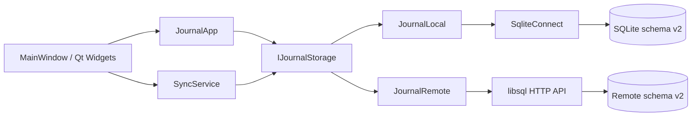

# Architecture

## Слои

```mermaid
flowchart LR
  UI[MainWindow / Qt Widgets] --> APP[JournalApp]
  APP --> ST[IJournalStorage]
  ST --> LOCAL[JournalLocal]
  ST --> REMOTE[JournalRemote]
  LOCAL --> SQLITE[SqliteConnect]
  SQLITE --> LDB[(SQLite schema v2)]
  REMOTE --> API[libsql HTTP API]
  API --> RDB[(Remote schema v2)]
  UI --> SYNC[SyncService]
  SYNC --> ST
```

`MainWindow` отвечает за widgets и запуск use cases. `JournalApp` работает
через `IJournalStorage`. SQL находится в `SqliteConnect`/`JournalRemote`.
`SyncService` переносит полный snapshot одного месяца.

## Доменная модель

### `Participant`

Глобальный человек:

- `ParticipantId` — стабильный UUID;
- `displayName` — редактируемое отображаемое имя.

Имя не является ключом. Одинаковые имена допустимы.

### `month_participants`

Связь участника с конкретным `(year, month)`. Удаление этой связи убирает
человека из месяца, но не удаляет `Participant` и историю других месяцев.

### `attendance`

Отметка принадлежит `(year, month, day, participant_id)`. Составной FK
запрещает attendance без membership этого месяца.

### `MonthSnapshot`

Содержит:

- participants текущего месяца;
- active days;
- attendance.

Snapshot применяется целиком только в sync-сценариях. Обычное сохранение UI
делает upsert attendance и не меняет membership/profile.

## SQLite schema v2

- `participants`;
- `month_participants`;
- `attendance`;
- `month_days`.

Обязательны:

- `PRAGMA foreign_keys = ON` для каждого connection;
- `CHECK` для year/month/day/boolean;
- unique primary keys;
- индексы чтения месяца и истории участника;
- `PRAGMA user_version = 2`.

`saveActiveDays()` не удаляет attendance выключенных дней. При повторном
включении сохраненная отметка восстанавливается.

## Development DB policy

Schema `users(name, date, is_checked)` и формат `dd.MM` больше не поддерживаются.
Проект еще не имеет production DB, поэтому migration v1 не нужна. Unversioned DB с
старыми таблицами отклоняется с явной ошибкой. Для продолжения файл dev-БД надо
удалить; приложение создаст schema v2 заново.
## Sync contract

Push/pull работают с `MonthSnapshot`, а не с `name + day`.

- Push заменяет remote membership/active days/attendance одного месяца.
- Pull заменяет local membership/active days/attendance одного месяца.
- Global participant rows upsert-ятся, но не удаляются full replace.
- Ошибка remote read не трактуется как пустой месяц.
- Remote writes используют Hrana batch: DML идет по `ok`-conditions, rollback —
  по отрицанию успешного commit.
- Pull читает participants/days/attendance одной read transaction.

Текущий HTTP-клиент синхронный и использует вложенный `QEventLoop`. Это PoC,
не production transport. До синхронизации фото/персональных данных нужны async,
auth, TLS, revisions и conflict handling.
