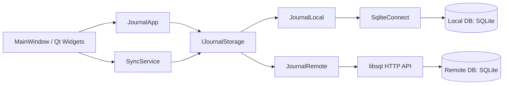
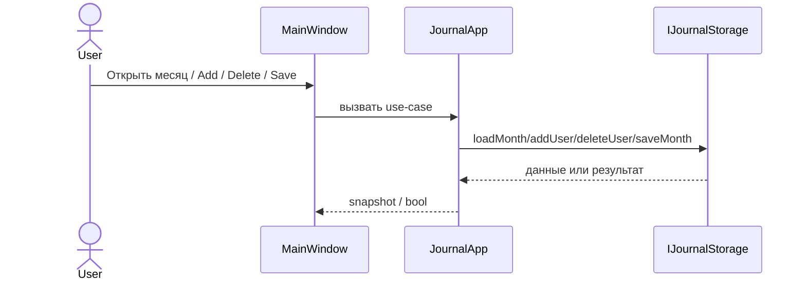
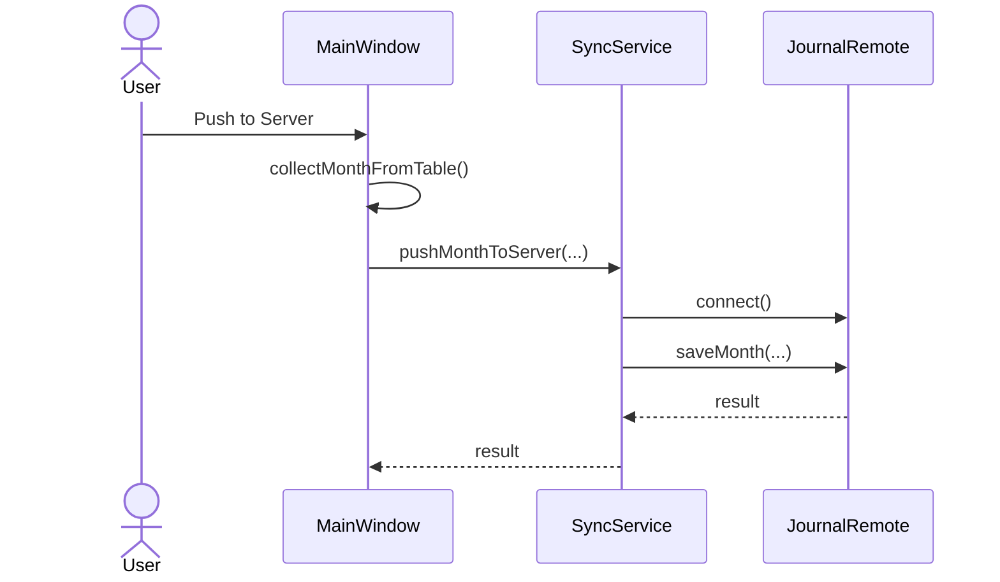
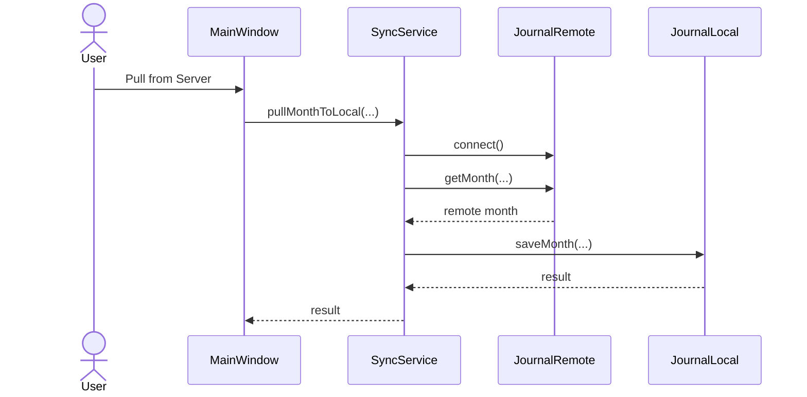

# Architecture

## Цель

Текущая архитектура разделяет приложение на:

1. `UI` слой на Qt Widgets.
2. `Use-case` слой с операциями над месяцем.
3. `Storage` абстракцию с двумя реализациями:
   `local` через SQLite и `remote` через HTTP/libsql.
4. Отдельный `SyncService` для явных сценариев `push/pull`.

## Актуальная схема

```mermaid
flowchart LR
  UI[MainWindow / Qt Widgets] --> APP[JournalApp]
  APP --> ST[IJournalStorage]
  ST --> LOCAL[JournalLocal]
  ST --> REMOTE[JournalRemote]
  LOCAL --> SQLITE[SqliteConnect]
  SQLITE --> LDB[(Local DB: SQLite)]
  REMOTE --> API[libsql HTTP API]
  API --> RDB[(Remote DB: SQLite)]

  UI --> SYNC[SyncService]
  SYNC --> ST
```

### Что означает схема

1. `MainWindow` отвечает за ввод пользователя, обновление виджетов и запуск сценариев.
2. `JournalApp` содержит прикладные операции:
   `loadMonth(...)`, `addUser(...)`, `deleteUser(...)`, `saveMonth(...)`.
3. `IJournalStorage` задает единый контракт для доступа к данным месяца.
4. `JournalLocal` адаптирует этот контракт к SQLite через `SqliteConnect`.
5. `JournalRemote` адаптирует тот же контракт к remote server по HTTP.
6. `SyncService` вызывается из UI отдельно от `JournalApp` и работает через storage-контракт.

## Роли классов

### `MainWindow`

- Инициализирует UI.
- Создает и переключает активный storage: `local` или `remote`.
- Вызывает `JournalApp` для обычных пользовательских операций.
- Вызывает `SyncService` для `Push to Server` и `Pull from Server`.

### `JournalApp`

- Это use-case слой между UI и storage.
- Не знает, работает ли он с SQLite или с remote backend.
- Работает через интерфейс `IJournalStorage`.
- Хранит текущий открытый месяц, чтобы `addUser/deleteUser` работали в контексте выбранного месяца.

### `IJournalStorage`

Единый интерфейс для всех хранилищ:

- `lastError()`
- `getMonthState(...)`
- `getUsersForMonth(...)`
- `getActiveDays(...)`
- `getMonth(...)`
- `saveActiveDays(...)`
- `saveMonth(...)`
- `saveMonthSetup(...)`
- `addUser(...)`
- `deleteUser(...)`

### `JournalLocal`

- Реализация `IJournalStorage` для локальной БД.
- Почти вся SQL-логика делегируется в `SqliteConnect`.

### `SqliteConnect`

- Низкоуровневый адаптер работы с SQLite.
- Открывает соединение.
- Гарантирует наличие схемы.
- Выполняет чтение/сохранение месяца.
- Добавляет и удаляет пользователя в рамках месяца.

### `JournalRemote`

- Реализация `IJournalStorage` для remote server.
- Отправляет SQL через HTTP pipeline API.
- Умеет читать и сохранять месяц на сервере.
- Поддерживает `connect()` как логическую проверку доступности сервера и схемы.

### `SyncService`

- Отдельный сервис синхронизации.
- `pushMonthToServer(...)` отправляет локальный снимок месяца на сервер.
- `pullMonthToLocal(...)` читает месяц с сервера и сохраняет его в local storage.

## Потоки выполнения

### Обычная работа в local или remote

```mermaid
sequenceDiagram
  actor User
  participant UI as MainWindow
  participant APP as JournalApp
  participant ST as IJournalStorage

  User->>UI: Открыть месяц / Add / Delete / Save
  UI->>APP: вызвать use-case
  APP->>ST: loadMonth/addUser/deleteUser/saveMonth
  ST-->>APP: данные или результат
  APP-->>UI: snapshot / bool
```

### Push на сервер

```mermaid
sequenceDiagram
  actor User
  participant UI as MainWindow
  participant SYNC as SyncService
  participant REM as JournalRemote

  User->>UI: Push to Server
  UI->>UI: collectMonthFromTable()
  UI->>SYNC: pushMonthToServer(...)
  SYNC->>REM: connect()
  SYNC->>REM: saveMonth(...)
  REM-->>SYNC: result
  SYNC-->>UI: result
```

### Pull с сервера

```mermaid
sequenceDiagram
  actor User
  participant UI as MainWindow
  participant SYNC as SyncService
  participant REM as JournalRemote
  participant LOC as JournalLocal

  User->>UI: Pull from Server
  UI->>SYNC: pullMonthToLocal(...)
  SYNC->>REM: connect()
  SYNC->>REM: getMonth(...)
  REM-->>SYNC: remote month
  SYNC->>LOC: saveMonth(...)
  LOC-->>SYNC: result
  SYNC-->>UI: result
```

## Архитектурные идеи, которые уже есть в коде

1. `Adapter`
   `JournalLocal` и `JournalRemote` приводят разные источники данных к одному интерфейсу `IJournalStorage`.

2. `Strategy`
   `JournalApp` работает с той реализацией `IJournalStorage`, которую ему передали.

3. `Dependency Injection`
   Конкретный storage передается в `JournalApp` извне, а не создается внутри него.

4. `Service`
   `SyncService` вынесен в отдельный объект, потому что это отдельный сценарий синхронизации, а не обязанность UI или storage.

5. `Observer`
   На уровне UI используется Qt signal/slot механизм через `connect(...)`.

## Важное уточнение

В проекте есть legacy-файлы:

- `mainTableManager.*`
- `dbManager.*`
- `checkTableManager.*`

Они отражают более ранний этап разработки, но не являются ядром текущей архитектуры. Актуальный поток работы проходит через:

- `MainWindow`
- `JournalApp`
- `IJournalStorage`
- `JournalLocal` / `JournalRemote`
- `SqliteConnect`
- `SyncService`
