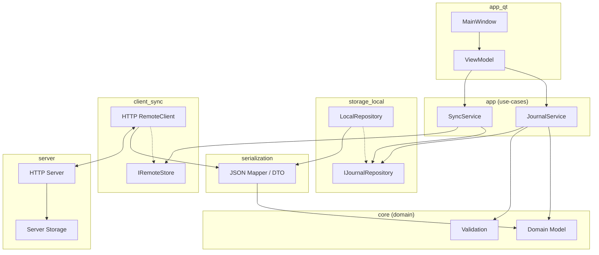

## Описание архитектуры

Кратко о слоях и их ответственности:

- **UI (app_qt)** — Qt-интерфейс, экраны и виджеты, взаимодействие с пользователем.
- **APP (app)** — бизнес-логика и сценарии (use-cases): сервисы работы с журналом и синхронизации.
- **CORE (core)** — доменная модель и правила валидации; сериализация доменных объектов.
- **STORAGE (storage_local)** — локальное хранение: репозитории и их реализации.
- **CLIENT (client_sync)** — клиент синхронизации и интерфейс удалённого хранилища.
- **SERVER (server)** — HTTP-сервер и серверное хранилище.

Связи между слоями:

- UI вызывает сервисы уровня APP.
- APP работает с доменной моделью CORE и обращается к локальным репозиториям.
- Сервис синхронизации использует локальное хранилище, удалённый клиент и сериализацию.
- Клиент синхронизации общается с сервером по HTTP.

