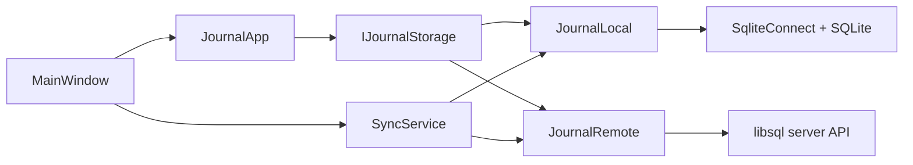
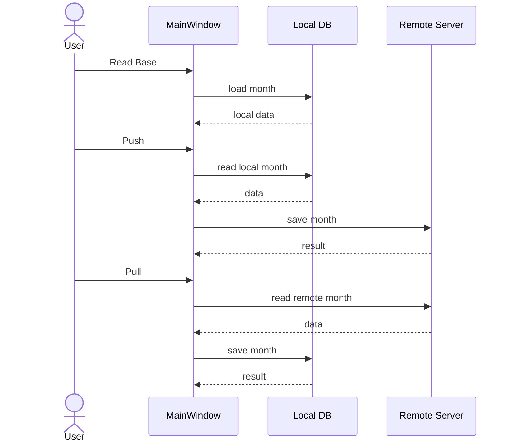

# Simple Diagrams For Presentation

## 1) Architecture (simple)

```mermaid
flowchart LR
  UI[MainWindow]
  APP[JournalApp]
  ST[IJournalStorage]
  LOCAL[JournalLocal]
  REMOTE[JournalRemote]
  SQL[SqliteConnect + SQLite]
  API[libsql server API]
  SYNC[SyncService]

  UI --> APP
  APP --> ST
  ST --> LOCAL
  ST --> REMOTE
  LOCAL --> SQL
  REMOTE --> API

  UI --> SYNC
  SYNC --> LOCAL
  SYNC --> REMOTE
```

## 2) How it works (simple)

```mermaid
sequenceDiagram
  actor User
  participant UI as MainWindow
  participant L as Local DB
  participant R as Remote Server

  User->>UI: Read Base
  UI->>L: load month
  L-->>UI: local data

  User->>UI: Push
  UI->>L: read local month
  L-->>UI: data
  UI->>R: save month
  R-->>UI: result

  User->>UI: Pull
  UI->>R: read remote month
  R-->>UI: data
  UI->>L: save month
  L-->>UI: result
```
